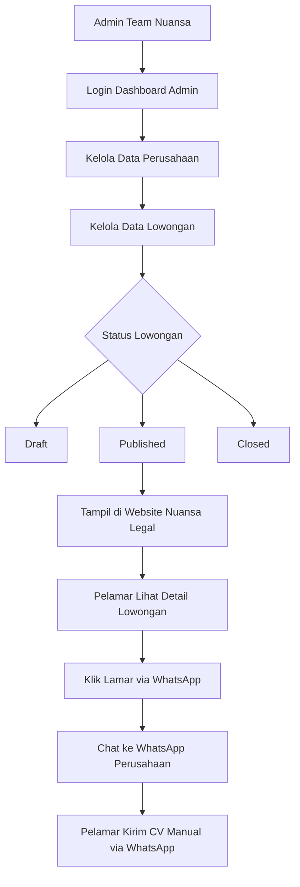
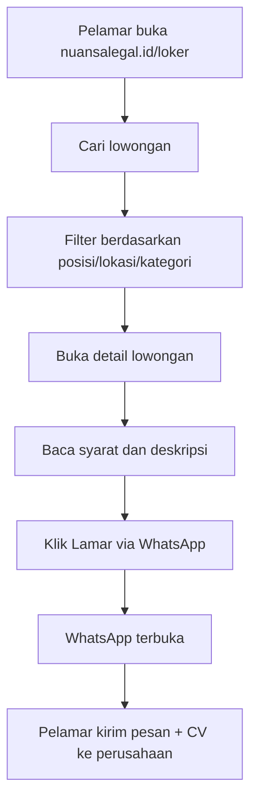

Siap bro. **Alur baru ini jauh lebih masuk akal untuk MVP Nuansa Legal.**
Karena sekarang sistemnya bukan lagi marketplace loker dengan banyak role, tapi jadi:

> **Admin-managed Job Board**
> Admin/team Nuansa input data perusahaan dan lowongan, lalu lowongan tampil public di website Nuansa Legal. Pelamar tidak perlu akun, cukup lihat detail loker dan apply via WhatsApp ke perusahaan terkait.

Ini jauh lebih ringan, lebih cepat dibuat, lebih aman dari sisi data, dan cocok untuk tahap awal.

---

# 1. Konsep Final Sistem

## Role hanya 1: Admin / Team Nuansa

Tidak ada role pelamar.
Tidak ada role perusahaan.
Tidak ada dashboard perusahaan.
Tidak ada tracking lamaran di sistem.

Jadi sistemnya:

```text id="w6ah2u"
Admin / Team Nuansa
↓
Login ke dashboard
↓
Input data perusahaan
↓
Input lowongan
↓
Publish lowongan
↓
Lowongan tampil di nuansalegal.id/loker
↓
Pelamar klik "Lamar via WhatsApp"
↓
Pelamar kirim CV langsung ke WhatsApp perusahaan
```

---

# 2. Pembagian Sistem

Secara besar, cukup ada 2 bagian:

| Bagian                               | Fungsi                                     | Akses             |
| ------------------------------------ | ------------------------------------------ | ----------------- |
| **Admin Controller / Dashboard Web** | Input, edit, publish, close lowongan       | Admin/team Nuansa |
| **Loker UI Public**                  | Menampilkan lowongan ke pengunjung website | Semua pengunjung  |

Struktur aksesnya:

```text id="5vx5ak"
nuansalegal.id/loker
→ halaman public loker

nuansalegal.id/loker/[slug]
→ detail lowongan public

admin.nuansalegal.id
atau
nuansalegal.id/admin-loker
→ dashboard admin
```

Rekomendasi gue:

```text id="j48b2w"
Public:
nuansalegal.id/loker

Admin:
admin.nuansalegal.id
```

Kenapa admin lebih bagus dipisah subdomain?

* Lebih rapi.
* Lebih aman.
* Tidak mengganggu website utama.
* Dashboard admin tidak tercampur dengan halaman public.
* Bisa diberi proteksi lebih ketat.

---

# 3. Stack yang Dipakai

Sesuai request lu:

```text id="yxmxrp"
UI/UX: React + TypeScript
API: Next.js API Routes / Route Handlers
Database: Supabase PostgreSQL
Auth Admin: Supabase Auth
Storage: Supabase Storage
Deployment: Vercel / VPS
```

Tapi secara teknis, gue saranin pakai **Next.js fullstack** aja, karena Next.js sudah pakai React + TypeScript juga.

Jadi arsitektur idealnya:

```text id="3a89ck"
Next.js App Router
├── Public UI Loker
├── Admin Dashboard UI
├── API Route Handlers
└── Supabase Integration
```

Dengan model ini, lu nggak perlu bikin React app dan Next API secara terpisah. Lebih clean dan gampang deploy.

---

# 4. Arsitektur Sistem



---

# 5. Flow Admin

Admin/team Nuansa hanya perlu mengelola data.

## Flow input perusahaan

```text id="dn23l4"
Login admin
↓
Masuk menu Perusahaan
↓
Klik Tambah Perusahaan
↓
Isi nama perusahaan, logo, bidang usaha, lokasi, WhatsApp HR
↓
Simpan
↓
Perusahaan bisa dipakai untuk lowongan
```

Data perusahaan ini **bukan diinput oleh perusahaan langsung**, tapi oleh admin Nuansa.

---

## Flow input lowongan

```text id="fp9zbt"
Login admin
↓
Masuk menu Lowongan
↓
Klik Tambah Lowongan
↓
Pilih perusahaan
↓
Isi detail posisi
↓
Isi job description, requirement, benefit
↓
Isi nomor WhatsApp tujuan apply
↓
Preview tampilan
↓
Publish
↓
Lowongan tampil di website
```

---

## Flow update status lowongan

```text id="7suw39"
Draft
→ belum tampil public

Published
→ tampil public

Closed
→ tidak menerima lamaran lagi

Expired
→ otomatis tidak aktif setelah tanggal expired
```

---

# 6. Flow Pelamar

Pelamar tidak perlu login.



Ini simple banget dan user friendly.

---

# 7. Flow WhatsApp Apply

Ketika pelamar klik tombol:

```text id="9f9unu"
Lamar via WhatsApp
```

Sistem akan membuka WhatsApp dengan pesan otomatis.

Contoh template:

```text id="9oc9mx"
Halo HR [Nama Perusahaan], saya tertarik melamar posisi [Nama Posisi] yang saya lihat di Nuansa Legal Career Hub.

Nama:
Domisili:
Pendidikan terakhir:
Pengalaman singkat:

Saya akan melampirkan CV saya melalui chat ini. Terima kasih.
```

Link teknisnya:

```text id="lsxpfx"
https://wa.me/628xxxxxxxxxx?text=Halo%20HR%20...
```

Tapi gue saranin jangan langsung taruh link WhatsApp mentah di frontend. Lebih bagus pakai endpoint redirect:

```text id="97uj9f"
/api/jobs/[slug]/apply
```

Kenapa?

Karena endpoint ini bisa:

* mencatat jumlah klik apply,
* memastikan lowongan masih aktif,
* redirect ke WhatsApp perusahaan,
* mencegah link error kalau nomor WA berubah.

Flow-nya:

```text id="ip0p9q"
Pelamar klik Lamar
↓
Hit API /api/jobs/[slug]/apply
↓
API cek lowongan published/aktif
↓
API catat apply click
↓
API redirect ke WhatsApp perusahaan
```

---

# 8. Struktur Halaman Public Loker

## A. Halaman `/loker`

Isi halaman:

```text id="eqhg6i"
Hero Section
Search Bar
Filter Lowongan
List Lowongan
Kategori Populer
Perusahaan yang Membuka Lowongan
CTA Untuk Perusahaan
FAQ Loker
```

Contoh struktur UI:

```text id="kq0vpm"
Nuansa Legal Career Hub

Temukan lowongan kerja dari perusahaan terpercaya.

[ Cari posisi... ] [ Lokasi ] [ Kategori ] [ Cari ]

Lowongan Terbaru
- Legal Staff
- Admin Operasional
- Staff Finance
- Marketing Executive
```

---

## B. Halaman detail `/loker/[slug]`

Isi detail:

```text id="2x6boz"
Judul Lowongan
Nama Perusahaan
Lokasi
Tipe Kerja
Range Gaji
Deadline

Deskripsi Pekerjaan
Tanggung Jawab
Kualifikasi
Benefit
Tentang Perusahaan

[Lamar via WhatsApp]
```

Di bagian bawah wajib ada warning:

```text id="cgjeqb"
Nuansa Legal tidak memungut biaya apa pun dari pelamar. Hati-hati terhadap pihak yang meminta pembayaran selama proses rekrutmen.
```

Ini penting banget biar trust tetap aman.

---

# 9. Menu Admin Dashboard

Karena role cuma admin, dashboard-nya bisa simple tapi tetap powerful.

```text id="bj7rkz"
Dashboard
├── Overview
├── Perusahaan
├── Lowongan
├── Kategori
├── Lokasi
├── Statistik Apply Click
├── Media / Logo
├── Pengaturan WhatsApp
└── Admin Log
```

---

## A. Dashboard Overview

Isi:

```text id="d1fva7"
Total Lowongan
Lowongan Published
Lowongan Draft
Lowongan Closed
Total Perusahaan
Total Klik Apply WhatsApp
Lowongan Paling Banyak Diklik
```

Contoh card:

```text id="les8i1"
Lowongan Aktif: 24
Draft: 5
Closed: 8
Apply Click Bulan Ini: 312
```

---

## B. Menu Perusahaan

Admin bisa:

```text id="vzegyh"
Tambah perusahaan
Edit perusahaan
Upload logo
Atur nomor WhatsApp HR
Atur status aktif/tidak aktif
Lihat jumlah lowongan dari perusahaan tersebut
```

Data perusahaan:

```text id="f4u5s0"
Nama perusahaan
Slug perusahaan
Logo
Bidang usaha
Deskripsi
Alamat/lokasi
Website
Instagram/LinkedIn
Email HR
WhatsApp HR
Status aktif
```

---

## C. Menu Lowongan

Admin bisa:

```text id="0bdupd"
Tambah lowongan
Edit lowongan
Preview lowongan
Publish lowongan
Close lowongan
Hapus lowongan
Duplicate lowongan
Atur tanggal expired
```

Status lowongan:

```text id="47b4xr"
draft
published
closed
expired
archived
```

---

## D. Menu Statistik Apply Click

Karena pelamar apply via WhatsApp, sistem tidak menyimpan CV. Tapi sistem masih bisa menyimpan statistik klik.

Data statistik:

```text id="7u7h26"
Lowongan mana yang paling banyak diklik
Perusahaan mana yang paling diminati
Jumlah klik per hari
Jumlah klik per bulan
Sumber halaman/referrer
```

Ini berguna buat laporan internal.

---

# 10. Struktur Database Supabase

Ini schema yang menurut gue paling pas untuk alur baru.

## `admin_users`

Untuk mapping user Supabase Auth yang boleh akses dashboard.

```sql
create table admin_users (
  id uuid primary key default gen_random_uuid(),
  user_id uuid references auth.users(id) on delete cascade,
  name text not null,
  role text default 'admin',
  is_active boolean default true,
  created_at timestamptz default now()
);
```

---

## `companies`

Menyimpan data perusahaan yang lowongannya tampil di website.

```sql
create table companies (
  id uuid primary key default gen_random_uuid(),
  name text not null,
  slug text unique not null,
  logo_url text,
  industry text,
  description text,
  address text,
  city text,
  province text,
  website_url text,
  instagram_url text,
  linkedin_url text,
  email_hr text,
  whatsapp_hr text not null,
  is_active boolean default true,
  created_at timestamptz default now(),
  updated_at timestamptz default now()
);
```

---

## `job_categories`

Kategori lowongan.

```sql
create table job_categories (
  id uuid primary key default gen_random_uuid(),
  name text not null,
  slug text unique not null,
  icon text,
  is_active boolean default true,
  created_at timestamptz default now()
);
```

Contoh kategori:

```text id="380ww5"
Legal & Compliance
Admin
Finance
HR
Marketing
Sales
Operasional
IT
Customer Service
```

---

## `jobs`

Ini tabel utama lowongan.

```sql
create table jobs (
  id uuid primary key default gen_random_uuid(),
  company_id uuid references companies(id) on delete cascade,
  category_id uuid references job_categories(id),

  title text not null,
  slug text unique not null,

  location text,
  city text,
  province text,

  employment_type text,
  work_arrangement text,
  experience_level text,

  salary_min numeric,
  salary_max numeric,
  show_salary boolean default false,

  description text not null,
  responsibilities text,
  requirements text,
  benefits text,

  apply_whatsapp_number text,
  apply_message_template text,

  status text default 'draft',
  is_featured boolean default false,

  published_at timestamptz,
  expired_at timestamptz,

  created_by uuid references auth.users(id),
  created_at timestamptz default now(),
  updated_at timestamptz default now()
);
```

Value untuk beberapa field:

```text id="4mh98p"
employment_type:
fulltime, parttime, contract, internship, freelance

work_arrangement:
onsite, hybrid, remote

experience_level:
freshgraduate, junior, mid, senior

status:
draft, published, closed, expired, archived
```

---

## `job_apply_clicks`

Untuk mencatat klik tombol WhatsApp.

```sql
create table job_apply_clicks (
  id uuid primary key default gen_random_uuid(),
  job_id uuid references jobs(id) on delete cascade,
  clicked_at timestamptz default now(),
  referrer text,
  user_agent text,
  ip_hash text
);
```

Catatan penting:
Jangan simpan IP mentah kalau tidak perlu. Cukup hash IP untuk analytics ringan.

---

## `admin_logs`

Untuk mencatat aktivitas admin.

```sql
create table admin_logs (
  id uuid primary key default gen_random_uuid(),
  admin_id uuid references auth.users(id),
  action text not null,
  target_type text,
  target_id uuid,
  description text,
  created_at timestamptz default now()
);
```

Contoh log:

```text id="xjxvq4"
Admin publish lowongan Legal Staff
Admin edit data perusahaan PT ABC
Admin close lowongan Staff Finance
```

---

# 11. Struktur Folder Next.js

Rekomendasi struktur clean:

```text id="ho2vgr"
nuansa-career/
├── app/
│   ├── page.tsx
│   │
│   ├── loker/
│   │   ├── page.tsx
│   │   ├── [slug]/
│   │   │   └── page.tsx
│   │   └── perusahaan/
│   │       └── [slug]/
│   │           └── page.tsx
│   │
│   ├── admin/
│   │   ├── login/
│   │   │   └── page.tsx
│   │   ├── dashboard/
│   │   │   └── page.tsx
│   │   ├── companies/
│   │   │   ├── page.tsx
│   │   │   ├── create/
│   │   │   │   └── page.tsx
│   │   │   └── [id]/
│   │   │       └── edit/
│   │   │           └── page.tsx
│   │   ├── jobs/
│   │   │   ├── page.tsx
│   │   │   ├── create/
│   │   │   │   └── page.tsx
│   │   │   └── [id]/
│   │   │       └── edit/
│   │   │           └── page.tsx
│   │   └── categories/
│   │       └── page.tsx
│   │
│   ├── api/
│   │   ├── jobs/
│   │   │   ├── route.ts
│   │   │   └── [slug]/
│   │   │       ├── route.ts
│   │   │       └── apply/
│   │   │           └── route.ts
│   │   ├── admin/
│   │   │   ├── jobs/
│   │   │   │   └── route.ts
│   │   │   ├── companies/
│   │   │   │   └── route.ts
│   │   │   └── dashboard/
│   │   │       └── route.ts
│   │   └── upload/
│   │       └── route.ts
│   │
│   └── layout.tsx
│
├── components/
│   ├── public/
│   │   ├── JobCard.tsx
│   │   ├── JobFilter.tsx
│   │   ├── JobDetail.tsx
│   │   └── CompanyCard.tsx
│   │
│   ├── admin/
│   │   ├── AdminSidebar.tsx
│   │   ├── AdminHeader.tsx
│   │   ├── JobForm.tsx
│   │   ├── CompanyForm.tsx
│   │   └── DataTable.tsx
│   │
│   └── ui/
│       ├── Button.tsx
│       ├── Input.tsx
│       ├── Select.tsx
│       ├── Card.tsx
│       └── Badge.tsx
│
├── lib/
│   ├── supabase/
│   │   ├── client.ts
│   │   ├── server.ts
│   │   └── admin.ts
│   ├── auth.ts
│   ├── whatsapp.ts
│   ├── slug.ts
│   └── validators.ts
│
├── types/
│   ├── job.ts
│   ├── company.ts
│   └── database.ts
│
├── middleware.ts
├── .env.local
└── package.json
```

---

# 12. API Endpoint yang Dibutuhkan

## Public API

```text id="0jvvxh"
GET /api/jobs
GET /api/jobs/[slug]
GET /api/jobs/[slug]/apply
```

Fungsi:

| Endpoint                     | Fungsi                               |
| ---------------------------- | ------------------------------------ |
| `GET /api/jobs`              | Ambil semua lowongan published       |
| `GET /api/jobs/[slug]`       | Ambil detail lowongan                |
| `GET /api/jobs/[slug]/apply` | Catat klik lalu redirect ke WhatsApp |

---

## Admin API

```text id="sm55fl"
GET    /api/admin/dashboard
GET    /api/admin/jobs
POST   /api/admin/jobs
PATCH  /api/admin/jobs/[id]
DELETE /api/admin/jobs/[id]

GET    /api/admin/companies
POST   /api/admin/companies
PATCH  /api/admin/companies/[id]
DELETE /api/admin/companies/[id]

GET    /api/admin/categories
POST   /api/admin/categories
PATCH  /api/admin/categories/[id]
DELETE /api/admin/categories/[id]
```

Admin API harus dicek authentication-nya.

```text id="l3ugxl"
Request masuk
↓
Cek session Supabase Auth
↓
Cek user ada di admin_users
↓
Jika aktif, lanjut
↓
Jika tidak, reject 403
```

---

# 13. Auth & Security

Karena hanya admin yang login, security jadi lebih simpel.

## Admin login

Pakai Supabase Auth:

```text id="38ea0x"
Email + Password
```

Flow:

```text id="winbxx"
Admin buka /admin/login
↓
Login pakai email/password
↓
Supabase Auth validasi
↓
Middleware cek admin_users
↓
Masuk dashboard
```

---

## Middleware Protection

Route yang wajib dilindungi:

```text id="d1j4lf"
/admin/*
/api/admin/*
```

Public route tidak perlu login:

```text id="3fldrs"
/loker
/loker/[slug]
/api/jobs
/api/jobs/[slug]
/api/jobs/[slug]/apply
```

---

## Security Rules

Minimal wajib ada:

```text id="6m2u3a"
Admin route wajib login
Admin harus terdaftar di admin_users
Service role Supabase hanya di server
Validasi input form
Validasi upload logo
Slug unique
Rate limit endpoint apply click
Audit log aktivitas admin
```

Jangan pernah taruh ini di frontend:

```text id="n06nei"
SUPABASE_SERVICE_ROLE_KEY
```

Yang boleh public hanya:

```text id="nyybxk"
NEXT_PUBLIC_SUPABASE_URL
NEXT_PUBLIC_SUPABASE_ANON_KEY
```

---

# 14. Supabase Storage

Storage dipakai untuk:

```text id="cq8e1x"
Logo perusahaan
Gambar banner loker optional
Icon kategori optional
```

Tidak perlu storage CV karena CV dikirim manual via WhatsApp.

Ini bagus, bro, karena:

* Database lebih ringan.
* Tidak perlu handle data pribadi pelamar.
* Tidak perlu dashboard lamaran.
* Risiko keamanan lebih kecil.
* Development jauh lebih cepat.

Bucket Supabase:

```text id="ju7i4x"
company-logos
job-assets
```

File rule:

```text id="9lvvo0"
Logo maksimal 1 MB
Format png, jpg, jpeg, webp
Rename file otomatis
Simpan URL di table companies
```

---

# 15. UI/UX Public Loker

## Tampilan utama `/loker`

Style yang cocok:

```text id="rhujzw"
Clean
Corporate
Modern
Trust-focused
Simple navigation
```

Section:

```text id="c4bgzw"
Hero
Search & Filter
Featured Jobs
Latest Jobs
Company List
FAQ
CTA
```

Contoh layout:

```text id="i8l0vb"
[Hero]
Temukan Lowongan Kerja dari Perusahaan Terpercaya

[Search posisi] [Lokasi] [Kategori] [Cari]

[Lowongan Terbaru]
Card Lowongan
Card Lowongan
Card Lowongan

[Perusahaan Membuka Lowongan]
Company Card
Company Card

[FAQ]
Bagaimana cara melamar?
Apakah perlu daftar akun?
Apakah ada biaya?
```

---

## Job Card

```text id="cjwmey"
[Logo Perusahaan]
Legal Staff

PT Maju Bersama
Jakarta Selatan
Full-time · Onsite
Rp 5.000.000 - Rp 7.000.000

[Detail] [Lamar via WhatsApp]
```

Badge status:

```text id="a7xrp4"
Aktif
Featured
Remote
Fresh Graduate
```

---

## Detail Lowongan

```text id="kw4gb1"
Legal Staff

PT Maju Bersama
Jakarta Selatan
Full-time
Onsite
Deadline: 20 Juli 2026

Deskripsi Pekerjaan
...

Tanggung Jawab
...

Kualifikasi
...

Benefit
...

Tentang Perusahaan
...

[Lamar via WhatsApp]
```

---

# 16. UI/UX Admin Dashboard

Admin dashboard harus praktis, bukan terlalu rame.

## Dashboard Overview

```text id="7wcu49"
Total Lowongan
Lowongan Aktif
Lowongan Draft
Lowongan Closed
Total Perusahaan
Total Klik Apply
```

## Table Lowongan

Kolom:

```text id="e2uhhn"
Judul
Perusahaan
Kategori
Lokasi
Status
Tanggal Publish
Expired
Apply Click
Action
```

Action:

```text id="zsi1k0"
Preview
Edit
Publish
Close
Duplicate
Delete
```

## Form Lowongan

Field:

```text id="t77ve5"
Judul lowongan
Slug
Perusahaan
Kategori
Lokasi
Tipe pekerjaan
Sistem kerja
Level pengalaman
Gaji minimum
Gaji maksimum
Tampilkan gaji?
Deskripsi pekerjaan
Tanggung jawab
Kualifikasi
Benefit
Nomor WhatsApp apply
Template pesan WhatsApp
Status
Tanggal publish
Tanggal expired
Featured?
```

Saran UX penting:

* Ada tombol **Preview** sebelum publish.
* Ada status **Draft** default.
* Ada tombol **Duplicate** untuk lowongan mirip.
* Ada auto-generate slug dari judul.
* Ada auto-format nomor WhatsApp.

---

# 17. Integrasi ke Website NuansaLegal.id

Ada 2 opsi teknis.

## Opsi A — Next.js jadi bagian website utama

URL:

```text id="7e9z2r"
nuansalegal.id/loker
nuansalegal.id/loker/legal-staff-pt-abc
nuansalegal.id/admin-loker
```

Kelebihan:

* SEO lebih kuat karena masih di domain utama.
* User merasa masih di website Nuansa Legal.
* Branding lebih menyatu.

Kekurangan:

* Perlu setup hosting yang support Next.js.
* Kalau website utama sekarang pakai CMS/WordPress, butuh reverse proxy atau migrasi sebagian.

---

## Opsi B — Subdomain khusus

URL:

```text id="ckmyxe"
loker.nuansalegal.id
admin-loker.nuansalegal.id
```

Kelebihan:

* Setup lebih gampang.
* Tidak mengganggu website utama.
* Deploy bisa di Vercel.
* Website utama cukup tambah menu “Loker”.

Kekurangan:

* SEO sedikit terpisah dari domain utama.
* Perlu menjaga branding biar tetap terasa satu ekosistem.

---

## Rekomendasi gue

Kalau website utama Nuansa Legal sekarang masih CMS/template, pilih ini dulu:

```text id="cveb5z"
loker.nuansalegal.id
```

Lalu di navbar `nuansalegal.id`, tambah menu:

```text id="h1jdk7"
Loker
```

yang mengarah ke:

```text id="z2r4ta"
loker.nuansalegal.id
```

Nanti kalau sistem sudah stabil, baru bisa dipertimbangkan reverse proxy supaya tampil sebagai:

```text id="zjg34i"
nuansalegal.id/loker
```

---

# 18. Environment `.env.local`

Contoh environment:

```env
NEXT_PUBLIC_SUPABASE_URL=https://xxxxx.supabase.co
NEXT_PUBLIC_SUPABASE_ANON_KEY=xxxxx

SUPABASE_SERVICE_ROLE_KEY=xxxxx

NEXT_PUBLIC_SITE_URL=https://loker.nuansalegal.id
ADMIN_BASE_URL=https://admin.nuansalegal.id

WHATSAPP_DEFAULT_COUNTRY_CODE=62
```

Untuk production, service role hanya dipasang di environment server.

---

# 19. Business Logic Utama

## Published jobs only

Public hanya boleh melihat lowongan dengan status:

```text id="czlxvl"
published
```

Dan belum expired:

```text id="qpeg6z"
expired_at > now()
```

Query logic:

```text id="3cw25x"
status = published
AND expired_at >= now()
AND company.is_active = true
```

---

## Closed jobs

Kalau lowongan sudah closed, detail masih boleh tampil, tapi tombol apply dimatikan.

Contoh UI:

```text id="pqv3q9"
Lowongan ini sudah ditutup.
```

---

## Expired jobs

Bisa otomatis tidak muncul di list public.

Admin bisa punya tombol:

```text id="qgta8p"
Reopen
Duplicate
Archive
```

---

## Apply WhatsApp fallback

Urutan nomor WhatsApp:

```text id="0wupiz"
1. Pakai apply_whatsapp_number di jobs
2. Kalau kosong, pakai whatsapp_hr di companies
3. Kalau kosong, tombol apply disembunyikan
```

---

# 20. Statistik yang Bisa Diambil

Karena tidak ada akun pelamar, statistiknya fokus ke traffic dan klik.

```text id="swzppe"
Total view lowongan
Total klik apply
Apply click per lowongan
Apply click per perusahaan
Apply click per kategori
Lowongan paling populer
```

Untuk view tracking, bisa tambah tabel:

```sql
create table job_views (
  id uuid primary key default gen_random_uuid(),
  job_id uuid references jobs(id) on delete cascade,
  viewed_at timestamptz default now(),
  referrer text,
  user_agent text,
  ip_hash text
);
```

Tapi untuk MVP, cukup mulai dari `job_apply_clicks` dulu.

---

# 21. Timeline Realistis Versi Baru

Karena alurnya jauh lebih sederhana, timeline turun banyak.

Untuk 1 developer fullstack:

| Versi                         |       Estimasi |
| ----------------------------- | -------------: |
| MVP sederhana                 | **3–4 minggu** |
| MVP rapi dan layak public     | **5–6 minggu** |
| Production-ready lebih matang | **7–8 minggu** |

Timeline ideal:

| Minggu | Fokus                                          | Output                 |
| -----: | ---------------------------------------------- | ---------------------- |
|      1 | Setup project, Supabase, auth admin, schema DB | Fondasi sistem         |
|      2 | Admin dashboard perusahaan & lowongan          | Admin bisa input data  |
|      3 | Public loker UI + detail lowongan              | Lowongan tampil public |
|      4 | WhatsApp apply, filter, search, upload logo    | Flow utama selesai     |
|      5 | Polishing UI, responsive, SEO, validation      | Siap staging           |
|      6 | Testing, bug fix, deploy production            | MVP live               |

Jadi untuk alur baru ini, target paling sehat:

```text id="917bft"
5–6 minggu untuk MVP rapi
```

Kalau tampilannya simple dan dashboard admin pakai komponen siap pakai, **3–4 minggu juga bisa**, tapi hasilnya lebih basic.

---

# 22. MVP Scope yang Gue Saranin

## Wajib ada

```text id="k1uw0x"
Admin login
Admin dashboard
CRUD perusahaan
CRUD lowongan
CRUD kategori
Upload logo perusahaan
Publish/close lowongan
Public list loker
Public detail loker
Search/filter lowongan
Apply via WhatsApp
Apply click tracking
Responsive mobile
```

## Jangan dulu masuk MVP

```text id="hhyo2j"
Akun pelamar
Upload CV ke sistem
Dashboard perusahaan
Tracking lamaran
Chat internal
Payment
AI matching
Interview scheduler
```

Karena alur baru lu memang tidak butuh itu dulu.

---

# 23. Risiko Teknis

| Risiko                          | Solusi                                       |
| ------------------------------- | -------------------------------------------- |
| Website utama bukan Next.js     | Pakai subdomain dulu                         |
| Nomor WA perusahaan tidak valid | Buat auto-format dan validasi nomor          |
| Lowongan expired masih tampil   | Query public wajib filter status dan tanggal |
| Admin lupa close loker          | Tambahkan expired_at                         |
| Link WhatsApp error             | Gunakan endpoint redirect                    |
| Data dummy tampil public        | Default status selalu draft                  |
| Upload logo terlalu besar       | Validasi ukuran dan format                   |
| Admin route kebuka              | Middleware + Supabase Auth                   |

---

# 24. Kesimpulan Final

Menurut gue, rancangan baru ini **jauh lebih tepat untuk tahap awal**.

Daripada bikin portal besar dengan banyak role, alur baru ini lebih clean:

```text id="x5yqgo"
1 dashboard admin
1 public loker UI
pelamar apply via WhatsApp
data perusahaan dikelola admin Nuansa
```

Dengan stack:

```text id="fvl43p"
React TypeScript
Next.js API
Supabase Database
Supabase Auth
Supabase Storage
```

Arsitektur finalnya:

```text id="laq3rn"
Admin Dashboard
→ kelola perusahaan
→ kelola lowongan
→ publish

Public Loker UI
→ tampilkan lowongan
→ detail lowongan
→ apply via WhatsApp
```

Estimasi realita:

```text id="252tx2"
MVP basic: 3–4 minggu
MVP rapi: 5–6 minggu
Production-ready: 7–8 minggu
```

**Saran gue bro:** ambil target **6 minggu**. Itu paling aman untuk 1 developer fullstack, hasilnya masih bisa rapi, responsive, secure, dan layak ditempel ke ekosistem Nuansa Legal.
